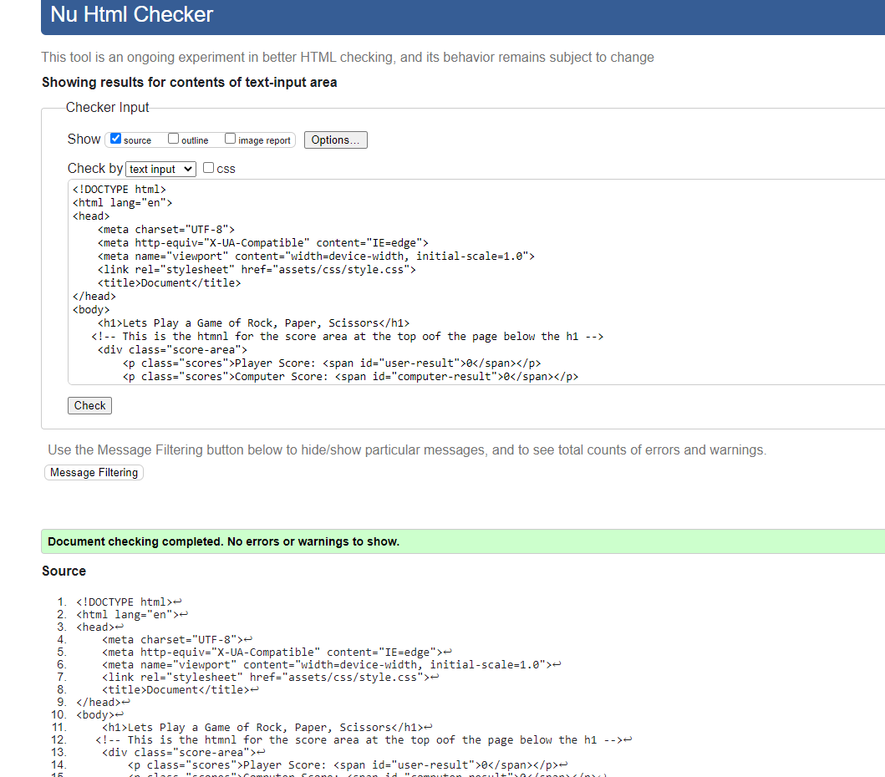
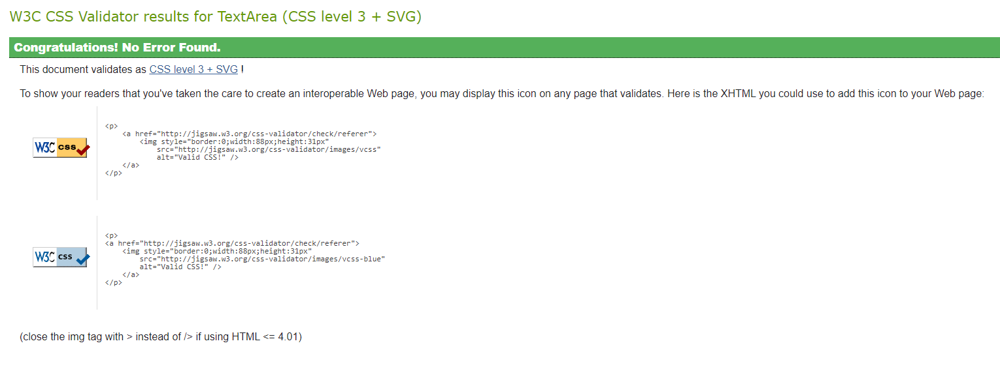
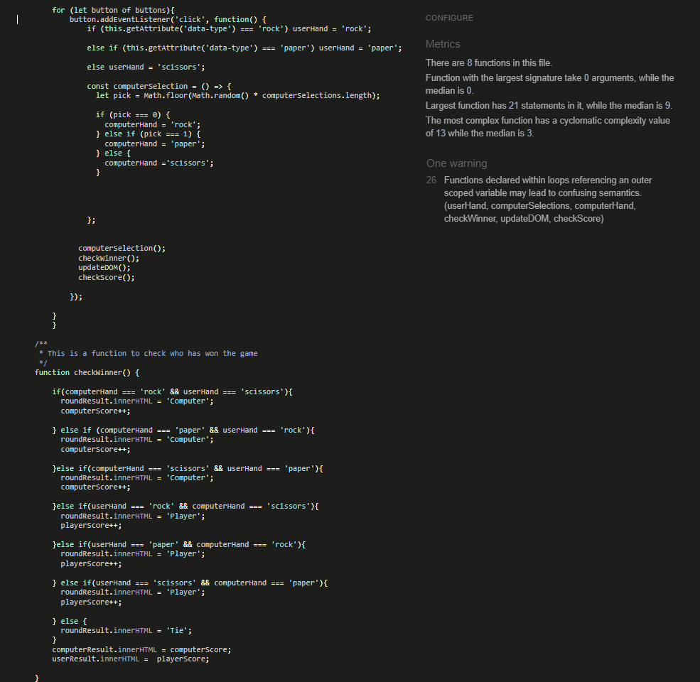
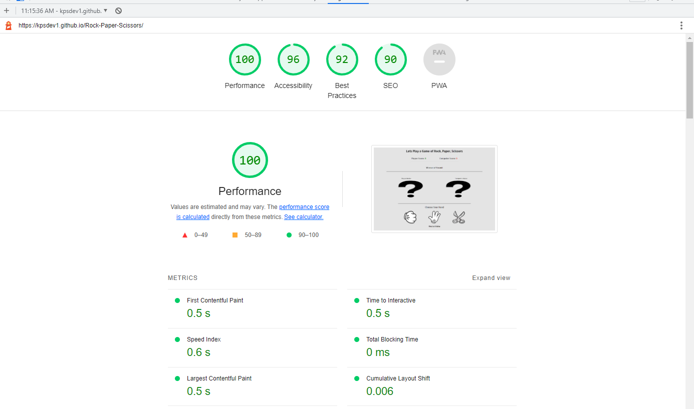

# Rock Paper Scissors

This is a simple Rock, Paper, Scissors game which I built with HTML, CSS and JavaScript. It is a one page interactive site which takes in input from the user in the form of the user selecting their hand(rock, paper or scissors), then it displays their choice with a image of their chosen hand, at the same time it computes the computers hand and displays the corresponding image and then chooses the winner.
  
  

 [Click Here To Visit Live Site](https://kpsdev1.github.io/Rock-Paper-Scissors/)  
- - -

## Table of Contents
1. [UX Design](#ux-design)
2. [Features](#features)
3. [Future Features](#future-features)
4. [Technologies Used](#technologies-used)
5. [Testing](#testing)
6. [Deployment](#deployment)
7. [Credits](#credits)
8. [Acknowledgements](#acknowledgements)

## UX Design:

### User Stories
- As a user, I want to be able to figure out what the game is.
- As a user, I want to be easily be able to understand how to play the game.
- As a user, I want to know what  score the game is up too.
- As a user, I want to be able to easily navigate through the game.
- As a user, I want the score to be easily visible so I can clearly see who is winning.

### Wireframes
Below are the wire frames fro the Rock, Paper, Scissors game for both destop and mobile devices.  
  
 **Desktop Design**   

  
 **Mobile Design**   
   
  

[Back to the top](#rock-paper-scissors)
- - -

### Typography
The font that was used for this game was **Allerta Stencil**.

### Color Scheme
The color scheme that was used for this game was a light grey color for the background and the text is black, which really makes the text and images stand out. The users score dsiplays in green and the computers score displays in red which in this context would show the user that the green score is positive and red is negatative.
  
  

## Features:

### Logo and Score
- At the top of the page is the Logo that tells the first time user what the game is by saying **"Lets Play a Game of Rock, Paper, Scissors"**
- Beneath this is the game score area, this keeps count of the user and the computers score.
- The Users score is is displayed in green which is positive, each time the player wins the round the score is incremented by 1. The higher the green score the better.
- The Copmputers score is diaplyed in red which in this context is negative as each time the computer wins the sciore is also incremented by 1.
- The first to reach the score of 5 wins.
- Below the score area is a light horizontal line that spans 40% of the page and is centered.

     

### Round Winner
- This section is right below the score counting area and displays the winner of the round or if both the player and computer chose the same hand it will say **Tie**
- Below it is a horizontal line that spans 80% of the page and is centered. 
  
 

### Player and Computer hand choice image section
- This is the section that displays an image of the hand choosen by both the player and computer.
- Once the user selects a hand it will display the matching image choice on the left hand side, at the same time a randon choice will also be chosen for the computer and the matching image will be displayed on the right side.
- Above the image it will say  both the Player and computers choice.
- The player and computer hand choice images are seperated by a light colored vertical line.
- Below the images is a black horizontal line that spans 60vw and is centered.

 

### Choose your hand section
- In the center of this section there is text saying **"Choose Your Hand"**, which indicates to the player to chose their hand either Rock, Paper or Scissors.
- Each hand is a button with a image for each choice, when hovered over the size of the image gets larger.
- When the user select his choice this will also make the computer chose their hand through a random generator.
- The hand that the users selects will show the same image in the Player and computer choice setion above.
- Below this is a h3 element that displays the text **"First to 5 wins"** so that the user knows that the first one to reach 5 wins the game(the score can be seen at the top of the page).
  
   
  
 [Back to the top](#rock-paper-scissors)
- - -

## Demo
Below is a demo video of the game working and also numbered 1 - 10 are each of the hands that were chosen by the player and the copmputer.

1. Player chose Rock and Computer chose Paper, so the computer scored a point. Score is 0 - 1 to the computer.
2. Player chose Paper and Computer chose Rock, so the Player got a point. Score is now 1 - 1 which makes it even.
3. Player chose Scissors and Computer chose Rock, so the computer scored a point. Score is now 1 - 2 to the computer.
4. Player chose Paper and Computer chose Scissors, so the computer scored a point. Score is now 1- 3 to the computer.
5. Both the Player and Computer chose rock, so that hand was a tie and no-one scored a point.
6. Player chose Paper and Computer chose Scissors, so the computer scored a point. Score is now 1- 4 to the computer.
7. Both the Player and Computer chose Scissors, so that hand was a tie and no-one scored a point.
8. Both the Player and Computer chose Paper, so that hand was a tie and no-one scored a point.
9. Player chose Scissors and computer chose Rock, so the computer scores a point. That brings the score to 1- 5 which means the computer wins the game.
10. The restart button is then clicked to restart the game.  

<video src = "https://user-images.githubusercontent.com/108360638/189951692-e71a608a-c1fa-4a51-a1e1-873a0f42d51f.mp4" controls></video>

## Future Features:
The futuure features that I would Like to include are:
- Before starting the Game a prompt for the user to enter their name.
- Allow the user to select what the game is up to eg: 5, 10, 15.
- The choice to play a multiplayer game with another person online.

## Technologies Used:
The technologies that were used to create the game were:
- Balsamiq was used to create the wireframes.
- HTML was used for the mark up.
- CSS was used to style the game
- JavaScript was used to make the game interactive.

## Testing:
In order to make sure the Game was fully responsive and compatible with different devices and browsers, I tested the site on multiple browsers and devices. I also put the code throught Validators to make sure there were no major errors.

### Devices the Game was tested on
- IPhone 11.
- Samsung S8.
- Samsung A52.
- IPhone 7.
- Ipad 7.
- Dell Inspiron.
- Amazon Fire.
- Dell S27s22DC monitor.
- Lambdatest was used to test on
   * Samsung S20
   * OnePlus Nord N100

### Browsers the Game was tested on
- Google chrome
- Mozilla Firefox
- Microsoft Edge
- Lambdatest was used to test on
   * Brave 
   * Opera 
   * Safari

### Validator Testing
**HTML**
- The index page of the Game was put through the W3C Validator to check for any HTML syntax errors. The W3C Validator con be found [here](https://validator.w3.org/).
- The result showed that there was no errors in the HTML markup as you can see from the screenshot of the results below.
  
  

[Back to the top](#rock-paper-scissors)
- - -

 **CSS**
 - The CSS stylesheet was put through the W3C Jiqsaw validator to see if there was any errors. The W3C Jiqsaw validator can be found [here](https://jigsaw.w3.org/css-validator/).
 - As you can see from the screenshot of the result below there were no errors.
   
 

**JavaScript**
- The Javascript file was put through Jshint code validator to see if there were any errors. Jshuint can be found [here](https://jshint.com/)
- The validator returned no errors and one warning for having the variables declared outside the for loop, from reading online on Stack Overflow this is a common enough warning and does not cause any issue.
  
  

### Lighthouse.
- I used Lighthouse in Chrome Dev tools to generate a report that tests the sites Performance, Accessibility, Best practices and SEO.  
  
 

## Deployment:
The site is deployed using github pages. The following steps were used to deploy the site to Github pages:
- First make sure you are signed into Github.
- In github on the sites repositiory, click on the **Settings** button.
- On lefthand side menu. under **code and automation section** select **Pages**.
- Under **Branch** section, change the dropdown that says **none** to **main**.
- Then click **Save** and refresh the page, please note that it can take a few minutes for the site to be live.
- - -

## Credits:
### Content
- Web Dev Simplified video on youtube was a big help in how to structure the game. The Youtube video can be found [here](https://www.youtube.com/watch?v=1yS-JV4fWqY).
- Code with Ania Kubow is a great resource for anyone who wants to create Rock, Paper, Scissors with JS as she takes you through 3 different ways to go about creating it, from beginner to advanced. This is a great resource as it gives you an idea on how to go about creating the game you want. The Youtube video can be found [here](https://www.youtube.com/watch?v=RwFeg0cEZvQ).
- Geeksforgeeks.org have a great write up on how to create a Rock, Paper, Scissors game, this is  very good read as it goes through all the steps in details and after reading it will definitely help you with the creation of your game. The article can be found [here](https://www.geeksforgeeks.org/rock-paper-and-scissor-game-using-javascript/).
- [Google Fonts ](https://fonts.google.com/) for the Typography used on the site.
- w3Schools was great help for syntax that I could not remember and also for looking up new syntax, as their sandbox displays exactly what it does and allow syou to edit it to suit your needs. The website can be found [here](https://www.w3schools.com/).

### Media
- All the images for this site were taken from clipartmax website, The website can be found [here](https://www.clipartmax.com/).

## Acknowledgements:
- I would like to thank my mentor Adegbenga Adeye for all help throughout the project and for being really positive about the course.
- I would like to thank Code institutes Slack Communtiy as this helped me so much when I got stuck on part of my project and also with course challenges.
- I would also like to thank our chort facilitators Kenan Wright and Kasia Bogucka, for answering any course related questions I asked and for porviding us with a weekly study schedule.

