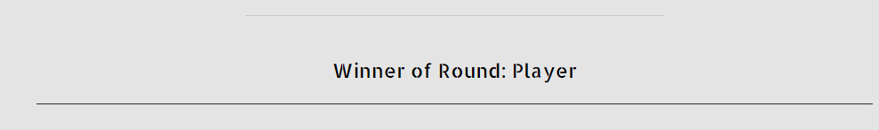
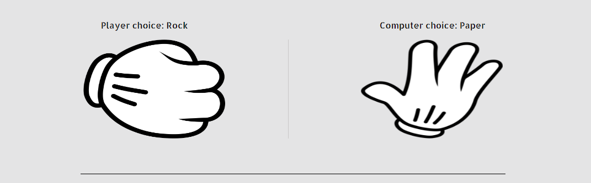
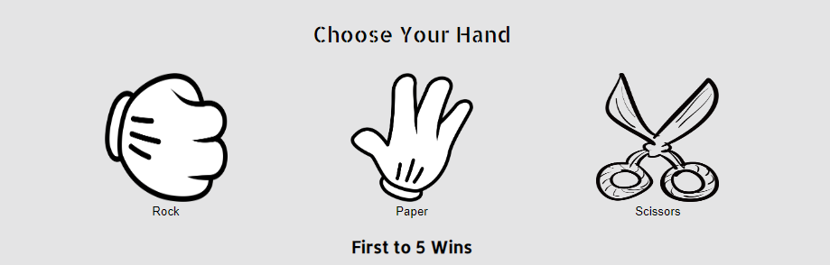

# Rock Paper Scissors

This is a simple Rock, Paper, Scissors game which I built with HTML, CSS and JavaScript. It is a one page interactive site which takes in input from the user in the form of the user selecting their hand(rock, paper or scissors), then it displays their choice with a image of their chosen hand, at the same time it computes the computers hand and displays the corresponding image and then chooses the winner.
  
  

 [Click Here To Visit Live Site](https://kpsdev1.github.io/Rock-Paper-Scissors/)  

## Table of Contents
1. [UX Design](#ux-design)
2. [Features](#features)
3. [Future Features](#future-features)
4. [Technologies Used](#technologies-used)
5. [Testing](#testing)
6. [Deployment](#deployment)
7. [Credits](#credits)
8. [Acknowledgements](#acknowledgements)

## UX Design:

### Wireframes
Below are the wire frames fro the Rock, Paper, Scissors game for both destop and mobile devices.  
  
 **Desktop Design**   

  
 **Mobile Design**   
   

### Typography
The font that was used for this game was **Allerta Stencil**.

### Color Scheme
The color scheme that was used for this game was a light grey color for the background and the text is black, which really makes the text and images stand out. The users score dsiplays in green and the computers score displays in red which in this context would show the user that the green score is positive and red is negatative.
  
  

## Features:

### Logo and Score
- At the top of the page is the Logo that tells the first time user what the game is by saying **"Lets Play a Game of Rock, Paper, Scissors"**
- Beneath this is the game score area, this keeps count of the user and the computers score.
- The Users score is is displayed in green which is positive, each time the player wins the round the score is incremented by 1. The higher the green score the better.
- The Copmputers score is diaplyed in red which in this context is negative as each time the computer wins the sciore is also incremented by 1.
- The first to reach the score of 5 wins.
- Below the score area is a light horizontal line that spans 40% of the page and is centered.

     

### Round Winner
- This section is right below the score counting area and displays the winner of the round or if both the player and computer chose the same hand it will say **Tie**
- Below it is a horizontal line that spans 80% of the page and is centered. 
  
 

### Player and Computer hand choice image section
- This is the section that displays an image of the hand choosen by both the player and computer.
- Once the user selects a hand it will display the matching image choice on the left hand side, at the same time a randon choice will also be chosen for the computer and the matching image will be displayed on the right side.
- Above the image it will say  both the Player and computers choice.
- The player and computer hand choice images are seperated by a light colored vertical line.
- Below the images is a black horizontal line that spans 60vw and is centered.

 

### Choose your hand section
- In the center of this section there is text saying **"Choose Your Hand"**, which indicates to the player to chose their hand either Rock, Paper or Scissors.
- Each hand is a button with a image for each choice, when hovered over the size of the image gets larger.
- When the user select his choice this will also make the computer chose their hand through a random generator.
- The hand that the users selects will show the same image in the Player and computer choice setion above.
- Below this is a h3 element that displays the text **"First to 5 wins"** so that the user knows that the first one to reach 5 wins the game(the score can be seen at the top of the page).
  
   

## Future Features:
The futuure features that I would Like to include are:
- Before starting the Game a prompt for the user to enter their name.
- Allow the user to select what the game is up to eg: 5, 10, 15.
- The choice to play a multiplayer game with another person online.

## Technologies Used:
The technologies that were used to create the game were:
- Balsamiq was used to create the wireframes.
- HTML was used for the mark up.
- CSS was used to style the game
- JavaScript was used to make the game interactive.

## Testing:

## Deployment:
The site is deployed using github pages. The following steps were used to deploy the site to Github pages:
- First make sure you are signed into Github.
- In github on the sites repositiory, click on the **Settings** button.
- On lefthand side menu. under **code and automation section** select **Pages**.
- Under **Branch** section, change the dropdown that says **none** to **main**.
- Then click **Save** and refresh the page, please note that it can take a few minutes for the site to be live.
- - -

## Credits:

## Acknowledgements:

