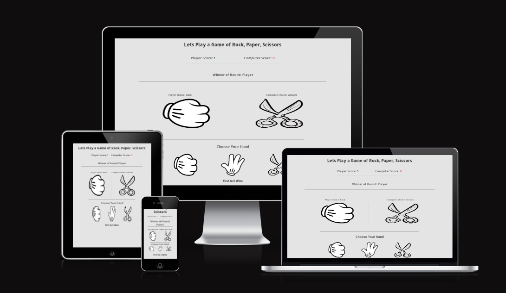
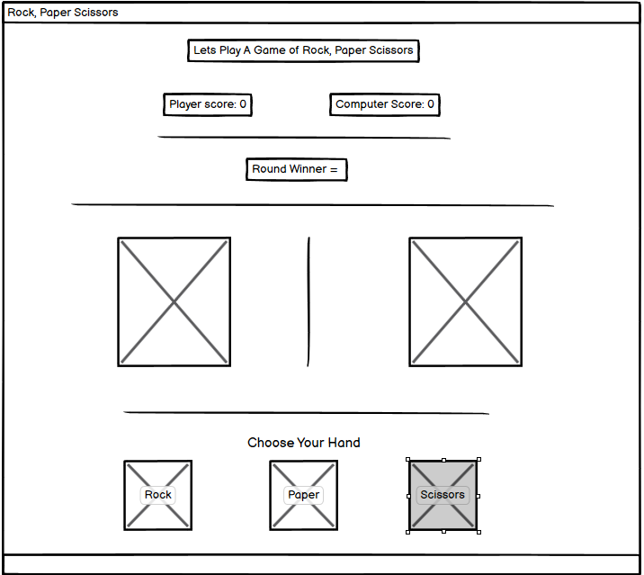
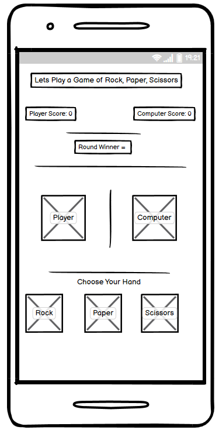
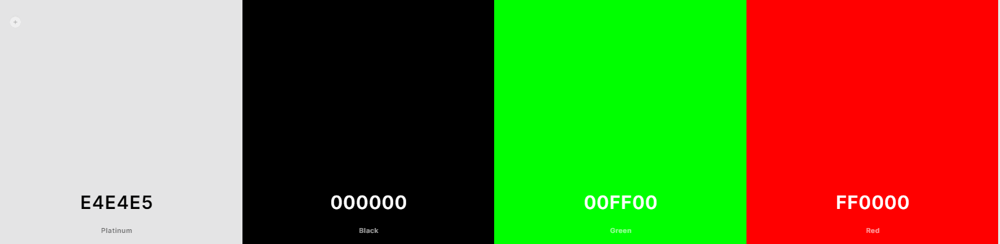

# Rock Paper Scissors

This is a simple Rock, Paper, Scissors game which I built with HTML, CSS and JavaScript. It is a one page interactive site which takes in input from the user in the form of the user selecting their hand(rock, paper or scissors), then it displays their choice with a image of their chosen hand, at the same time it computes the computers hand and displays the corresponding image and then chooses the winner.
  
  

 [Click Here To Visit Live Site](https://kpsdev1.github.io/Rock-Paper-Scissors/)  

## Table of Contents
1. [UX Design](#ux-design)
2. [Features](#features)
3. [Future Features](#future-features)
4. [Technologies Used](#technologies-used)
5. [Testing](#testing)
6. [Deployment](#deployment)
7. [Credits](#credits)
8. [Acknowledgements](#acknowledgements)

## UX Design:

### Wireframes
Below are the wire frames fro the Rock, Paper, Scissors game for both destop and mobile devices.  
  
 **Desktop Design**   

  
 **Mobile Design**   
   

### Typography
The font that was used for this game was **Allerta Stencil**.

### Color Scheme
The color scheme that was used for this game was a light grey color for the background and the text is black, which really makes the text and images stand out. The users score dsiplays in green and the computers score displays in red which in this context would show the user that the green score is positive and red is negatative.
  
  

## Features:

### Logo and Score
- At the top of the page is the Logo that tells the first time user what the game is by saying **Lets Play a Game of Rock, Paper, Scissors**
- Beneath this is the game score area, this keeps count of the user and the computers score.
- The Users score is is displayed in green which is positive, each time the player wins the round the score is incremented by 1. The higher the green score the better.
- The Copmputers score is diaplyed in red which in this context is negative as each time the computer wins the sciore is also incremented by 1.
- The game is the first up to rech the score of 5 wins.

## Future Features:
The futuure features that I would Like to include are:
- Before starting the Game a prompt for the user to enter their name.
- Allow the user to select what the game is up to eg: 5, 10, 15.
- The choice to play a multiplayer game with another person online.

## Technologies Used:

## Testing:

## Deployment:

## Credits:

## Acknowledgements:

