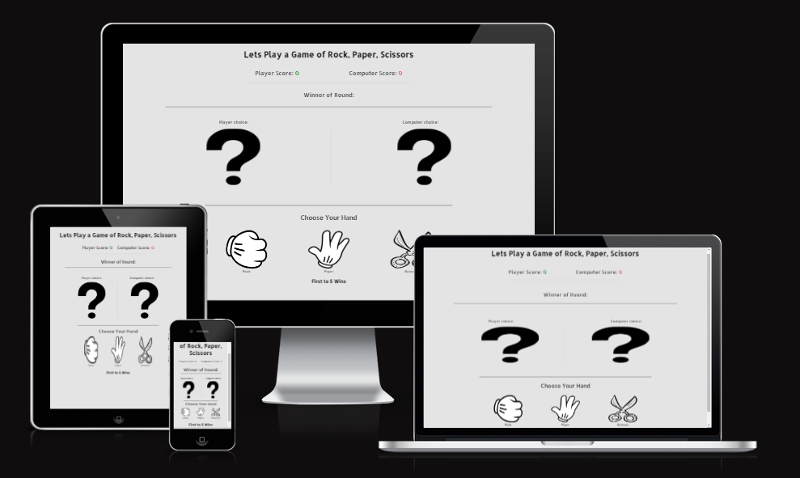
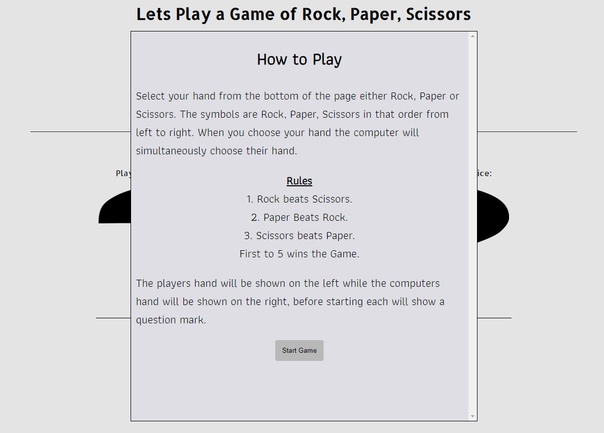
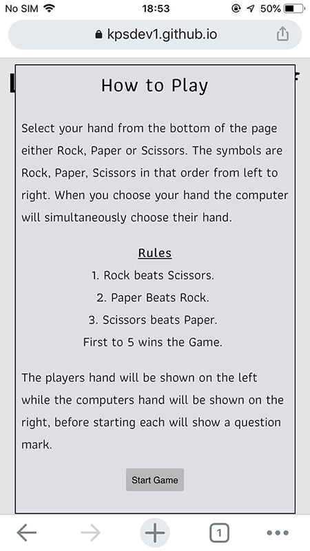
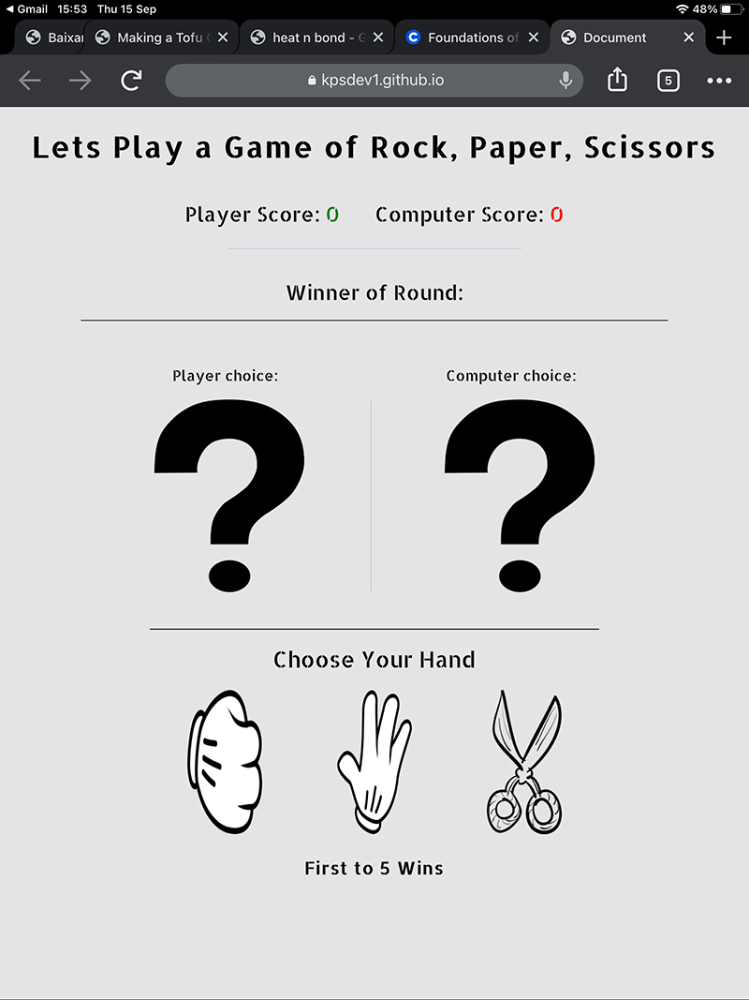
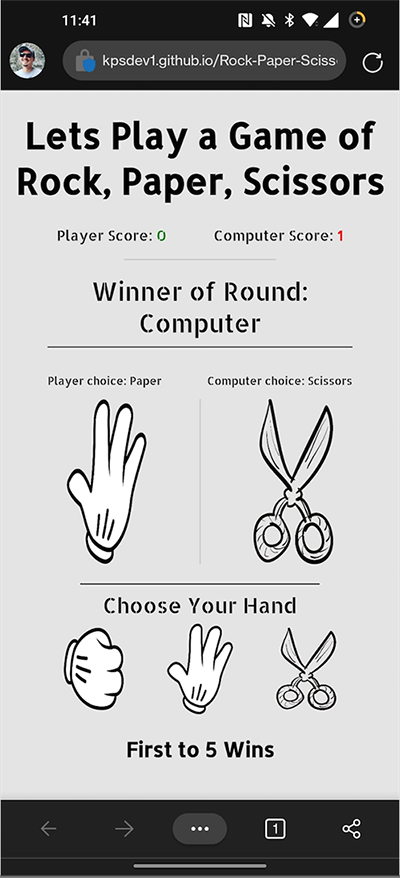
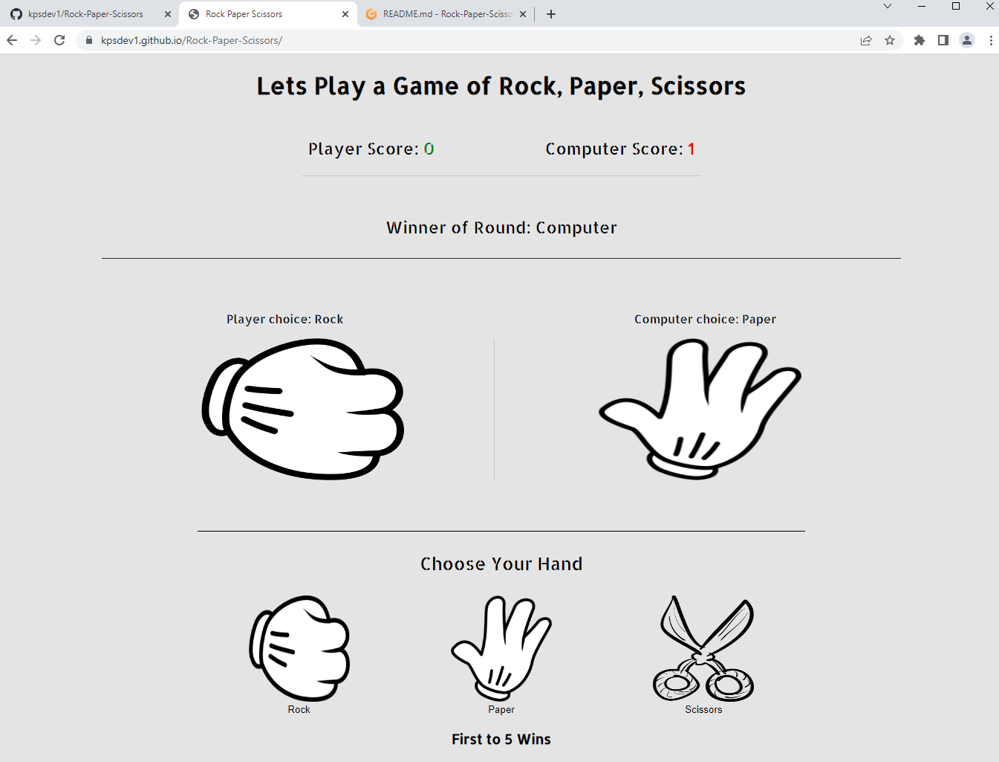
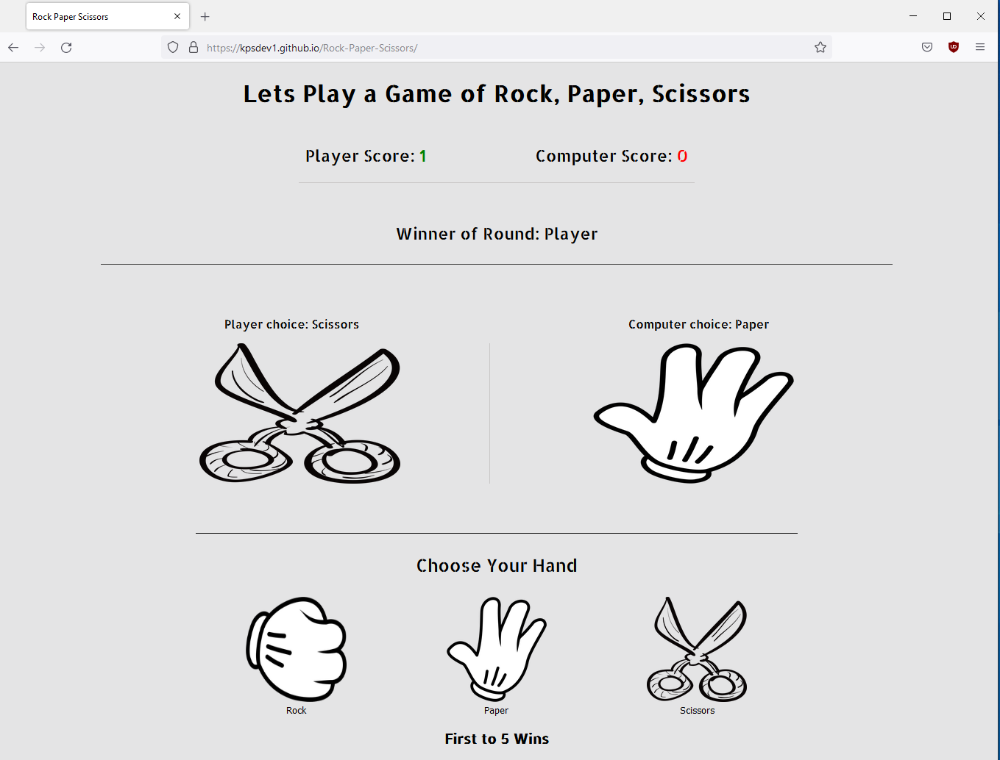
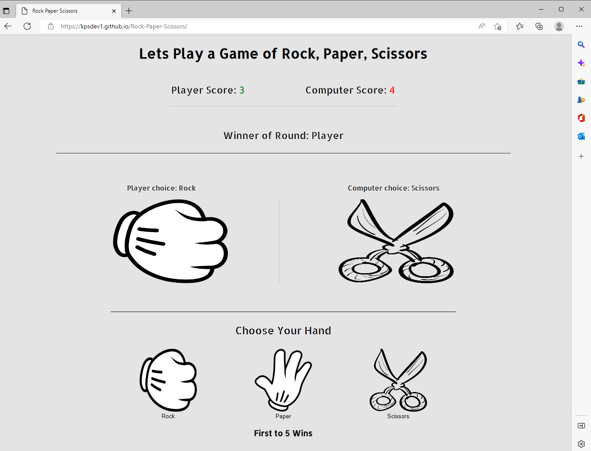

# Rock Paper Scissors

This is a simple Rock, Paper, Scissors game which I built with HTML, CSS and JavaScript. It is a one page interactive site which takes in input from the user in the form of the user selecting their hand(rock, paper or scissors), then it displays their choice with a image of their chosen hand, at the same time it computes the computers hand and displays the corresponding image and then chooses the winner.
  
  

 [Click Here To Visit Live Site](https://kpsdev1.github.io/Rock-Paper-Scissors/)  
- - -

## Table of Contents
1. [UX Design](#ux-design)
2. [Features](#features)
3. [Demo](#Demo)
4. [Future Features](#future-features)
5. [Technologies Used](#technologies-used)
6. [Testing](#testing)
7. [Bugs](#bugs)
8. [Deployment](#deployment)
9. [Credits](#credits)
10. [Acknowledgements](#acknowledgements)

## UX Design:

### User Stories
- As a user, I want to be able to figure out what the game is.
- As a user, I want to easily be able to understand how to play the game.
- As a user, I want to know what  score the game is up too.
- As a user, I want to be able to easily navigate through the game.
- As a user, I want the score to be easily visible so I can clearly see who is winning.

### Wireframes
Below are the wireframes for the Rock, Paper, Scissors game for both destop and mobile devices. The wireframes were designed using the Balsamiq.
  
 **Desktop Design**   

  
 **Mobile Design**   
   
  

[Back to the top](#rock-paper-scissors)
- - -

### Typography
The font that was used for this game was **Allerta Stencil**.  
The font that was used for the instructions screen was **Athiti**.

### Color Scheme
The color scheme that was used for this game was a light grey color for the background and the text is black, which really makes the text and images stand out. The users score displays in green and the computers score displays in red which in this context would show the user that the green score is positive and red is negatative.
  
  

## Features:

### How to Play
- The game instructions are displayed once the game loads and it is the first thing that the user sees.
- Here the user will learn how to play the game and see the rules of Rock, Paper, Scissors.
- I have set the overflow to scroll so that if a user has their Windows display scale settings turned up above the normal 100% then it overflow will still be inside the border.
- When the user wants to play a game they can just click the **Start Game** button and this will allow them to start the game, when the **Start Game** button is hovered over the
 button background color changes to black and the text to white.
   
       

### Heading and Score
- At the top of the page is a h1 heading that tells the first time user what the game is by saying **"Lets Play a Game of Rock, Paper, Scissors"**
- Beneath this is the game score area, this keeps count of the player and the computers score.
- The players score is displayed in green which is positive, each time the player wins the round the score is incremented by 1. The higher the green score the better.
- The computers score is displayed in red which in this context is negative as each time the computer wins a round the score is also incremented by 1.
- The first to reach the score of 5 wins.
- Below the score area is a light horizontal line that spans 40% of the page and is centered.

     

### Round Winner
- This section is right below the score counting area and displays the winner of the round or if both the player and computer choose the same hand it will say **Tie**
- Below it is a horizontal line that spans 80% of the page and is centered. 
  
 

### Player and Computer hand choice image section
- This is the section that displays an image of the hand choosen by both the player and computer. Before the game starts both the users and computers hand are set to images of a question mark.
- Once the user selects a hand it will display the matching image choice on the left hand side, at the same time a random choice will also be chosen for the computer and the matching image will be displayed on the right side.
- Above the image it will say  both the player and computers choice.
- The player and computers hand choice images are seperated by a light colored vertical line.
- Below the images is a black horizontal line that spans 60vw and is centered.

 

### Choose your hand section
- In the center of this section there is text saying **"Choose Your Hand"**, which indicates to the player to chose their hand either Rock, Paper or Scissors.
- Each hand is a button with a image for each choice, when hovered over the size of the image gets larger.
- When the user selects their choice this will also make the computer chose their hand through a random generator.
- The hand that the user selects will show the corresponding image for the players hand above. 
- Below this is a h3 element that displays the text **"First to 5 wins"** so that the user knows that the first one to reach 5 wins the game(the score can be seen at the top of the page).
  
  

 ### Winning Screen
 - When either the player or the computer reach 5 the winning popup is displayed.
 - It is displayed in the center of the screen and has a light background color, if the player wins it displays a green border(positive) and if the computer wins its displays a red border(negative).
 - There is text that either congratulates the player if they win or wishes them commiserations if they lose to the computer.
 - Below this text is a **Restart Game** button that has a dark background color with white text.

   
  

   

 [Back to the top](#rock-paper-scissors)
- - -

## Demo:
Below is a demo video of the game working and also numbered 1 - 10 are each of the hands that were chosen by the player and the computer.  

Please note that I have added a **how to play** screen that displays before the game starts, this is not shown in the video below, and I have changed the winner popup colour and style. I have also added Rock Paper and Scissors text under each of the images in the **Choose Your Hand** section.
1. Player chose Rock and Computer chose Paper, so the Computer scored a point. Score is 0 - 1 to the Computer.
2. Player chose Paper and Computer chose Rock, so the Player got a point. Score is now 1 - 1 which makes it even.
3. Player chose Scissors and Computer chose Rock, so the Computer scored a point. Score is now 1 - 2 to the Computer.
4. Player chose Paper and Computer chose Scissors, so the Computer scored a point. Score is now 1- 3 to the Computer.
5. Both the Player and Computer chose Rock, so that hand was a tie and no-one scored a point.
6. Player chose Paper and Computer chose Scissors, so the Computer scored a point. Score is now 1- 4 to the Computer.
7. Both the Player and Computer chose Scissors, so that hand was a tie and no-one scored a point.
8. Both the Player and Computer chose Paper, so that hand was a tie and no-one scored a point.
9. Player chose Scissors and Computer chose Rock, so the Computer scores a point. That brings the score to 1- 5 which means the Computer wins the game.
10. The restart button is then clicked to restart the game.  

<video src = "https://user-images.githubusercontent.com/108360638/189951692-e71a608a-c1fa-4a51-a1e1-873a0f42d51f.mp4" controls></video>

## Future Features:
The future features that I would Like to include are:
- Before starting the game a prompt for the user to enter their name.
- Allow the user to select what the game is up to eg: 5, 10, 15.
- The choice to play a multiplayer game with another random person online.(although this may be very hard to implement)

## Technologies Used:
The technologies that were used to create the game were:
- [Balsamiq](https://en.wikipedia.org/wiki/Balsamiq) was used to create the wireframes.
- [HTML](https://en.wikipedia.org/wiki/HTML) was used for the mark up.
- [CSS](https://en.wikipedia.org/wiki/CSS)  was used to style the game
- [JavaScript](https://en.wikipedia.org/wiki/JavaScript) was used to make the game interactive.
- [Gitpod](https://www.gitpod.io/about) was used to create this site and then push everything to github.
- [Visual Studio Code](https://en.wikipedia.org/wiki/Visual_Studio_Code) was used to work on the site locally.
- [Github](https://en.wikipedia.org/wiki/GitHub) is used to host this site.

## Testing:
In order to make sure the game was fully responsive and compatible with different devices and browsers, I tested the site on multiple browsers and devices. I also put the code throught validators to make sure there were no major errors. Just to note that when using different devices in Chrome dev tools the layout is not 100% accurate as when testing with the same devices for example the IPhone 7 the "How to play" screen looks different from how it actually looks on an Iphone 7, you will see from the real device screenshots below, that show how it actually looks. Also I have added Rock, Paper and Scissors text under each of the images in the **Choose Your Hand** section which is not displayed in the screenshots below as I had already gotten all the screenshots before adding the text.

### Below is a list of devices that the game was test on, with screenshots from each device.

- **IPhone 11**   

 
 
  

- **Samsung S8**  
 
   

 
  

- **IPhone 7**  

 
 
  

- **Ipad 7** 

 
  

- **OnePlus 8 Pro**

  

- **Lambdatest was used to test on a Samsung s20.**

  

- **I also tested the site on**
  * Dell Inspiron Gaming Laptop
  * Dell S2722DC Screen
  * Dell S2722DC
  * Dell Latitude 5420
  * Amazon fire
- - -

### Below is a list of browsers that the game was tested on, screenshots are also included.

- **Google chrome**  

    

- **Mozilla Firefox**

 

- **Microsoft Edge**

 

### Validator Testing
**HTML**
- The index page of the game was put through the W3C validator to check for any HTML syntax errors. The W3C validator can be found [here](https://validator.w3.org/).
- The result showed that there was no errors in the HTML markup as you can see from the screenshot of the results below.
  
  

[Back to the top](#rock-paper-scissors)
- - -

 **CSS**
 - The CSS stylesheet was put through the W3C Jiqsaw validator to see if there was any errors. The W3C Jiqsaw validator can be found [here](https://jigsaw.w3.org/css-validator/).
 - As you can see from the screenshot of the result below there were no errors.
   
 

**JavaScript**
- The Javascript file was put through Jshint code validator to see if there were any errors. Jshint can be found [here](https://jshint.com/)
- The validator returned no errors and one warning for having the variables declared outside of the for loop, from reading online this is a common enough warning and does not cause any issue. I also showed it to my mentor and he said this can be ignored as it is just a warning.
  
  

### Lighthouse.
- I used Lighthouse in Chrome Dev tools to generate a report that tests the sites Performance, Accessibility, Best Practices and SEO.  
  
 

## Bugs:
- When the **How to Play** pop up screen was showing, the Rock, Paper and Scissors button could still be clicked when viewing on a laptop or larger screen. To fix this I created a hide class
  which set the display to none for the button container, this was then toggled on when the page loaded and then once the **Start Game** button was clicked the the hide class is removed.
- When the winner pop up was displayed, the Rock, Paper and Scissors buttons were still able to be clicked so the user could keep adding points past the desired score of 5. To rectify this
  when the score reached 5 I have set the buttons to be disabled so if you click on them no points are added and nothing happens untill the next game is started.

## Deployment:
The site is deployed using github pages. The following steps were used to deploy the site to Github pages:
- First make sure you are signed into Github.
- In github on the sites repositiory, click on the **Settings** button.
- On lefthand side menu. under **Code and automation section** select **Pages**.
- Under **Branch** section, change the dropdown that says **none** to **main**.
- Then click **Save** and refresh the page, please note that it can take a few minutes for the site to be live.
- - -

## Credits:
### Content
- Web Dev Simplified video on youtube was a big help in how to structure the game. The Youtube video can be found [here](https://www.youtube.com/watch?v=1yS-JV4fWqY).
- Code with Ania Kubow youtube video is a great resource for anyone who wants to create Rock, Paper, Scissors with JS as she takes you through 3 different ways to go about creating it, from   beginner to advanced. This is a great resource as it gave me an idea on how to go about creating the game I wanted. The Youtube video can be found [here](https://www.youtube.com/watch?v=RwFeg0cEZvQ).
- Geeksforgeeks.org have a great write up on how to create a Rock, Paper, Scissors game, this is a very good read as it goes through all the steps in details and after reading the article it definitely helped me with the creation of my game. The article can be found [here](https://www.geeksforgeeks.org/rock-paper-and-scissor-game-using-javascript/).
- [Google Fonts ](https://fonts.google.com/) for the Typography used on the site.
- W3Schools was great help for syntax that I could not remember and also for looking up new syntax, as their sandbox displays exactly what it does and allows you to edit it to suit your needs. The website can be found [here](https://www.w3schools.com/).

### Media
- All the images for this site were taken from clipartmax website, The website can be found [here](https://www.clipartmax.com/).

## Acknowledgements:
- I would like to thank my mentor Adegbenga Adeye for all help throughout the project and for being really positive about the course.
- I would like to thank Code Institutes Slack Communtiy as this helped me so much when I got stuck on part of my project and also with course challenges.
- I would also like to thank our chort facilitators Kenan Wright and Kasia Bogucka, for answering any course related questions I asked and for porviding us with a weekly study schedule.

